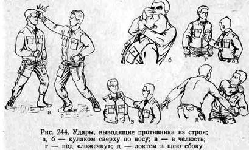

# Инструкция для работы с Markdown

## Выделение текста

Для добавления заголовка в текст добавьте перед ним решётку (#), пробел и нажмите Enter для переноса текста на следующую строку.
 Например, 
# Заголовок 1

Для добавления подзаголовка в текст добавьте перед ним двойную решётку (##),  пробел и нажмите Enter для переноса текста на следующую строку.
 Например, 
 ## Подзаголовок 1

 Для добавления заголовков уровней ниже, повторите вышеуказанные действия, проставив 3 или 4 решётки при необходимости проставления подзаголовков 3 или 4 уровней соответственно. Например,
 ### Подзаголовок 1.1.1.
 #### Подзаголовок 1.1.1.1.

 Для выделения текста *курсивом* обрамите его звёздочкой (*) или нижним подчёркиванием (_) с двух сторон. 
 Например, *вот так*

 Или, например, _вот так_

 Для выделения текста полужирным обрамите его двумя звёздочками (**) или двумя нижними подчёркиваниями (__) с двух сторон. Например, 

**вот так**

Или, например, __вот так__

Для выделения одной и той же части текста ***полужирным и курсивом*** одновременно обрамите его тремя звёздочками с двух сторон. 

Например, ***вот так***

Для выделения различных частей текста полужирным и курсивом в зависимости от контекста используйте неидентичные символы из указанных выше.

Например, *вот* __так__

**Или** вот *так*

## Списки

Для создания **ненумерованного** списка добавьте одну звёздочку (*), один плюс (+) или один минус (-)

Например, вот так:
* Элемент 1
- Элемент 2
+ Элемент 3

Для создания __нумерованного__ списка наберите число, поставьте точку, пробел, наберите текст и нажмите клавишу "Enter".

Например, вот так:

1. Элемент 1

2. Элемент 2

3. Элемент 3

## Работа с изображениями

Чтобы добавить изображение в документ, необходимо выполнить следующие шаги:

1. Добавить изображение в репозиторий.

2. Сохранить изображение через команду git add

3. Добавить коммит на внесённые изменения

4. В круглых скобках добавить текст, который будет отображаться при наличии проблем с загрузкой или демонстрацией фотографии, рядом через пробел добавить название файла, загруженного в репозиторий.

Например, это можно сделать так:

## Ссылки

Markdown позволяет оставлять в документе ссылки на внешние и внутренние источники.

+ Для вставки ссылки на внешний источник обрамите описание ресурса, на который будете ссылаться, квадратными скобками (**[]**), а ссылку на ресурс обрамите круглыми скобками **()**

Например, вот так:

[Senior QA в HeadHunter](https://hh.ru/analytics_source/vacancy/54168093?from=vacancy_search_catalog&hhtmFrom=vacancy_search_catalog&query=senior+QA&requestId=1656693386083c14d1c1c771670511de&totalVacancies=510&position=0&source=vacancies)

+ Для вставки ссылки на внутренний источиник, проделайте те же самые действия, но не указывайте в круглых скобках путь через https://.

Например, вот так

[Вставка фото в документ](0486f47862f2e453821cdfc50c5f22e9b6bd0fd0)

## Работа с таблицами

Для работы с таблицами используйте следующее символьное сочетание:

|Терминал  |Преимущества |Недостатки|
|----------|-----------|------------|
|Git Bash | pros №1, pros №2 | cons №1, cons №2 |
|Powershell | pros №1, pros №2 | cons №1, cons №2|
|JS Debug Terminal | pros №1, pros №2 | cons №1, cons №2|
Terminal №4 | pros №1, pros №2 | cons №1, cons №2|

Markdown также позволяет **выровнять таблицы** с помощью двоеточий, проставленных соответственно левее 1 столбца таблицы, правее последнего столбца таблицы и с обеих сторон таблицы по столбцам, расположенным между первым и последним столбцом. Это выглядит следующим образом:

|Терминал  |Преимущества |Недостатки|
|:----------|:-----------:|------------:|
|Git Bash | pros №1, pros №2 | cons №1, cons №2 |
|Powershell | pros №1, pros №2 | cons №1, cons №2|
|JS Debug Terminal | pros №1, pros №2 | cons №1, cons №2|
Terminal №4 | pros №1, pros №2 | cons №1, cons №2|

## Цитаты

Цитаты в Markdown можно оформлять двумя способами:

+ Проставлять символ > перед каждым абзацем цитаты

+ Проставлять символ > только перед началом нового параграфа

Ниже приведены примеры оформления цитат первым и вторым способом:

> Раз о самостоятельной, самими рабочими массами в ходе их движения вырабатываемой идеологии не может быть и речи, то вопрос стоит только так: буржуазная или социалистическая идеология. Середины тут нет (ибо никакой «третьей» идеологии не выработало человечество, да и вообще в обществе, раздираемом классовыми противоречиями, и не может быть никогда внеклассовой или надклассовой идеологии). Поэтому всякое умаление социалистической идеологии, всякое отстранение от неё означает тем самым усиление идеологии буржуазной. 
*(Автор цитаты, разумеется наш вождь мирового пролетариала и продакт оунер призрака коммунизма, бродящего по Европе, Ульянов Владимир Ильич)*

>Друзья, что, глупый промах мой кляня,
>Когда-то отказались от меня, —
>Для вас всегда мой дом открыт. Входите!
>Всех кто со мной смеялся и грустил,
>Люблю, как прежде. Я вас всех простил.
>Но только и меня, друзья, простите.
>(*Расул Гамзатов*)

## Особенности работы с удалёнными репозиториями в GitHub

### Клонирование репозитория из аккаунта в GitHub

* Для начала необходимо убедиться, что репозиторий сохранён в нашем аккаунте (к которому мы имеем доступ и можем авторизоваться и аутентифицироваться). При необходимости импортировать нужный репозиторий через кнопку "Fork" в GitHub.
* Затем необходимо скопировать ссылку (полный путь через https) на местоположение удалённого репозитория через выпадающее меню кнопки "Code"
* Далее необходимо вызвать в терминале команду *git clone https://github.com/username/repositoryname*, где username - логин к аккаунту, к которому у вас есть доступ, а repositoryname - название репозитория.
* При работе с локальными репозиториями мы инициализировали их прямо в локальной папке, но с удалённые репозитории инициализируются несколько иначе: необходимо вызвать в терминале команду *cd repositoryname*, где cd - команда для смены директории (change directory), а repositoryname - имя репозитория, который мы клонировали в наш удалённый репозиторий. Это необходимо для корректного отслеживания изменений в нужной папке.
* Затем можно вносить изменения в локальном репозитории.
* При необходимости отправить локальный репозиторий со всеми коммитами в GitHub сначала необходимо пройти авторизацию с вашей парой логина и пароля, затем ввести в терминал команду *git remote add origin https://github.com/username/repositoryname* для добавления конечного адреса перемещаемого репозитория с указанным адресом https, далее ввести команду *git branch -M main* для добавления новой ветки main и перехода на неё, и в заключение ввести команду *git push -u origin main* для отправки репозитория в GitHub.
* Там же при необходимости можно создать файл README и описать в нём специфику создаваемого проекта и необходимые детали
* Прямо в GitHub можно внести изменения в проект, закоммитить и сохранить их
* При необходимости можно загрузить последнюю версию проекта со всеми доработками, выполненными в удалённом репозитории на GitHub через команду *git pull*, которая скачивает последнюю версию проекта с GitHub и одновременно проводит попытку сделать слияние (merge) конечной версии проекта, выполненной в GitHub и версии проекта, оставшейся в локальном репозитории.
* При необходимости внесения изменений в open-source проект (проект с открытым исходным кодом) необходимо повторить те же шаги с копированием репозитория, и в конце через терминал вызвать команду *git pull request* для запроса на слияние выполненных изменений в проект владельцем репозитория.
